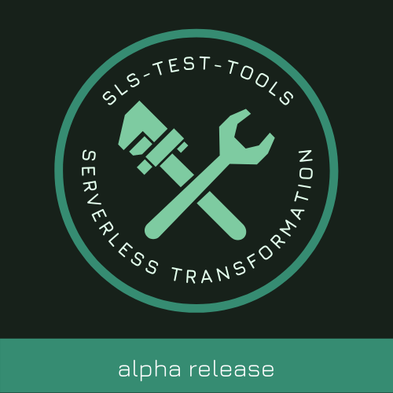

<div align="center">
  <h1>sls-test-tools</h1>
  

Custom Jest Assertions for Serverless Projects

</div>

<hr />

`sls-test-tools` provides a range of utilities, setup, teardown and assertions to make it easier to write effective and high quality integration tests for Serverless Architectures on AWS.

**🚧 This is in an alpha state while we trial a few initial assertions and get feedback on the approach and structure. 🚧**

**⚠️ AWS resources will be created (SQS Queue, EventBridge Rule...) if the EventBridge module is used. Although there is clear setup and teardown we do not advise running this on production environments currently. ⚠️**

## Installation

With npm:

```sh
npm install --save-dev sls-test-tools
```

With yarn:

```sh
yarn add -D sls-test-tools
```

## Maintenance

sls-test-tools is currently being actively maintained, yet is in alpha. Your feedback is very welcome.

## Assertions:

### EventBridge

```
    expect(eventBridgeEvents).toHaveEvent();

    expect(eventBridgeEvents).toHaveEventWithSource("order.created");
```

### S3

Note: these async assertions require "await"

```
    await expect("BUCKET NAME").toHaveS3ObjectWithNameEqualTo("FILE NAME");
```

```
    await expect("BUCKET NAME").toExistAsS3Bucket();
```

```
    await expect({
      bucketName: "BUCKET_NAME",
      objectName: "FILE NAME",
    }).toHaveContentTypeEqualTo("CONTENT_TYPE");;
```

where CONTENT_TYPE are [standards MIME types](https://developer.mozilla.org/en-US/docs/Web/HTTP/Basics_of_HTTP/MIME_types/Common_types)

```
    await expect({
      bucketName: "BUCKET_NAME",
      objectName: "FILE NAME",
    }).toHaveContentEqualTo("CONTENT");
```

### Step Functions

Note: these assertions also require "await"

```
    await expect("STATE_MACHINE_NAME").toHaveCompletedExecutionWithStatus("STATUS");
    await expect("STATE_MACHINE_NAME").toMatchStateMachineOutput({EXPECTED_OUTPUT}));
```

### DynamoDB

Note: these assertions also require "await"

```
    await expect("TABLENAME").toContainItemWithValues({[field]: value});
    await expect({PK: pk,
                  SK: sk,
                }).toExistInDynamoTable('TABLENAME');
```

### Cognito

Note: this assertion also requires "await"

```
  await expect('USER_POOL_ID').toContainUser('USERNAME');
```

## Helpers

### General

AWSClient - An AWS client with credentials set up

```
getStackResources(stackName) - get information about a stack
getOptions() - get options for making requests to AWS
```

### EventBridge

An interface to the deployed EventBridge, allowing events to be injected and intercepted via an SQS queue and EventBridge rule.

#### Static

```
    EventBridge.build(busName) - create a EventBridge instance to allow events to be injected and intercepted
```

#### Instance

```
    eventBridge.publishEvent(source, detailType, detail) - publish an event to the bus
    eventBridge.getEvents() - get the events that have been sent to the bus
    eventBridge.clear() - clear old messages
    eventBridge.destroy() - remove infastructure used to track events
```

### Step Functions

An interface to a deployed Step Function, with a function to execute a Step Function until its completion.

#### Static

```
  StepFunctions.build() // create a Step Functions Client for executing existing state machines
```

#### Instance

```
  stepFunctions.runExecution(stateMachineName, input) // executes state machine until completion
```

## Running with `jest`

### Arguments

- When running tests with `jest` using `sls-test-tools` matchers there are certain parameters needed for `sls-test-tools` to make assertions.
- These are passed either as command line arguments, using quotation to match `jests` convention on test arguments, or by using environment variables. CLI arguments override environment variables.

**Required**

- `'--stack=my-service-dev'` or `process.env.CFN_STACK_NAME` - the CloudFormation stack name of the stack under test.

**Optional**

- `'--profile=[PROFILE NAME]'` or `process.env.AWS_PROFILE` (will default to `default`)
- `'--region=[AWS Region]'` or `process.env.AWS_REGION` (will default to `eu-west-2`)
- `'--keep=true'` - keeps testing resources up to avoid creation throttles (e.g. SQS Queue created for EventBridge assertions)

- To avoid issues we recommend `--runInBand`

```
import { AWSClient, EventBridge } from "sls-test-tools";

const lambda = new AWSClient.Lambda()
let eventBridge;
const s3 = new AWSClient.S3()

describe("Integration Testing Event Bridge", () => {
  beforeAll(async () => {
    eventBridge = await EventBridge.build("event-bridge")
  });

  afterAll(async () => {
    await eventBridge.destroy()
  });

  it("correctly publishes an event to the event bus when the lambda is invoked", async () => {
    const event = {
      body: JSON.stringify({
        filename: filename,
      }),
    };

    // Invoke Lambda Function
    const params = {
      FunctionName: "event-bridge-example-dev-service1",
      Payload: JSON.stringify(event),
    };
    await lambda.invoke(params).promise();

    const eventBridgeEvents = await eventBridge.getEvents()
    expect(eventBridgeEvents).toHaveEvent();
    expect(eventBridgeEvents).toHaveEventWithSource("order.created");
  });

  it("correctly generates a PDF when an order is created", async () => {
    const bucketName = example-bucket
    await eventBridge
      .publishEvent("order.created", "example", JSON.stringify({ filename: filename }));

    await sleep(5000); // wait 5 seconds to allow event to pass

    const params = {
      Bucket: bucketName,
      Key: filename,
    };

    // Assert that file was added to the S3 bucket
    await expect("example-dev-thumbnails-bucket").toHaveS3ObjectWithNameEqualTo(
      filename
    );
  });
```

## Contributors ✨

Thanks goes to these wonderful people ([emoji key](https://allcontributors.org/docs/en/emoji-key)):

<!-- ALL-CONTRIBUTORS-LIST:START - Do not remove or modify this section -->
<!-- prettier-ignore-start -->
<!-- markdownlint-disable -->
<table>
  <tr>
    <td align="center"><a href="https://medium.com/serverless-transformation"><br /><sub><b>Ben Ellerby</b></sub></a><br /><a href="https://github.com/BenEllerby/sls-test-tools/commits?author=BenEllerby" title="Code">💻</a> <a href="#content-BenEllerby" title="Content">🖋</a> <a href="https://github.com/BenEllerby/sls-test-tools/commits?author=BenEllerby" title="Documentation">📖</a> <a href="#ideas-BenEllerby" title="Ideas, Planning, & Feedback">🤔</a> <a href="#design-BenEllerby" title="Design">🎨</a> <a href="#talk-BenEllerby" title="Talks">📢</a> <a href="https://github.com/BenEllerby/sls-test-tools/pulls?q=is%3Apr+reviewed-by%3ABenEllerby" title="Reviewed Pull Requests">👀</a></td>
    <td align="center"><a href="https://medium.com/serverless-transformation"><br /><sub><b>Sarah Hamilton</b></sub></a><br /><a href="https://github.com/BenEllerby/sls-test-tools/commits?author=hamilton-s" title="Code">💻</a> <a href="#content-hamilton-s" title="Content">🖋</a> <a href="https://github.com/BenEllerby/sls-test-tools/commits?author=hamilton-s" title="Documentation">📖</a> <a href="#ideas-hamilton-s" title="Ideas, Planning, & Feedback">🤔</a></td>
    <td align="center"><a href="https://github.com/agwhi"><br /><sub><b>Alex White</b></sub></a><br /><a href="https://github.com/BenEllerby/sls-test-tools/commits?author=agwhi" title="Code">💻</a><a href="https://github.com/BenEllerby/sls-test-tools/commits?author=agwhi" title="Documentation">📖</a></td>
  </tr>
</table>

<!-- markdownlint-enable -->
<!-- prettier-ignore-end -->

<!-- ALL-CONTRIBUTORS-LIST:END -->

This project follows the [all-contributors](https://github.com/all-contributors/all-contributors) specification. Contributions of any kind welcome!
